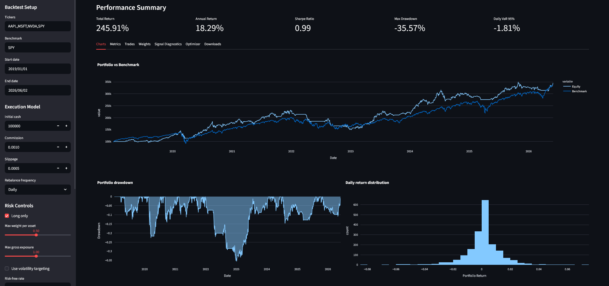
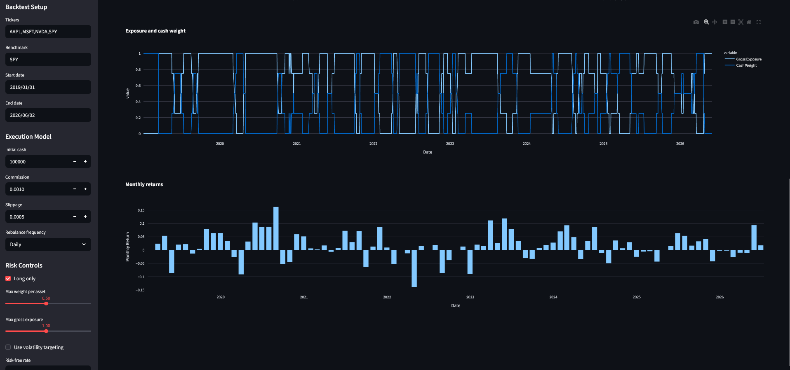
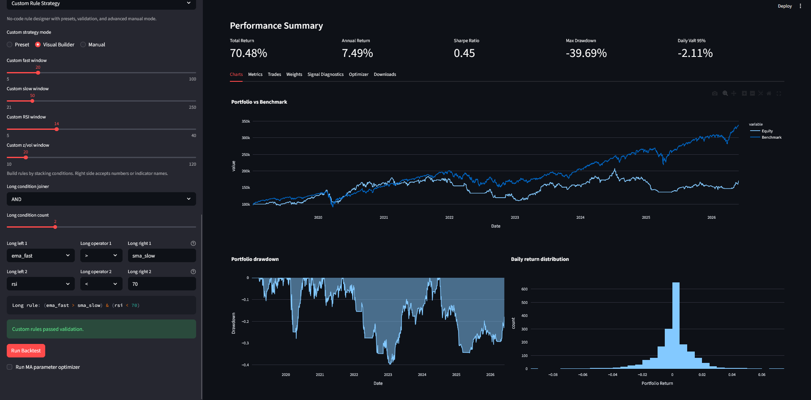
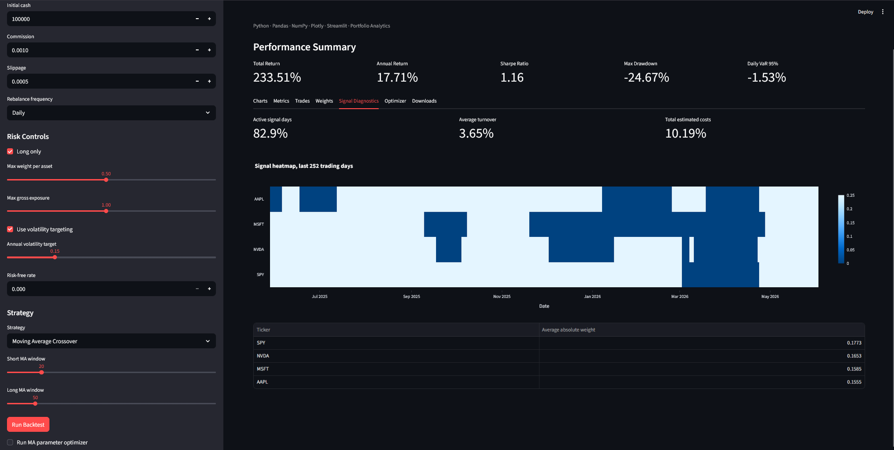
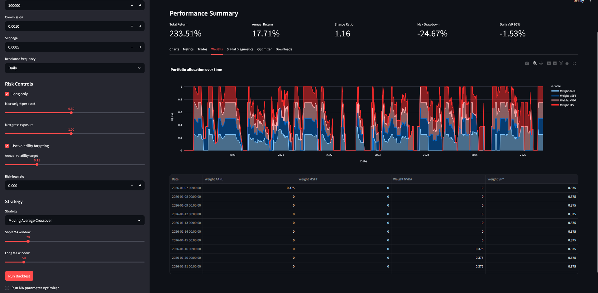

# Algorithmic Trading Backtester

A Python backtesting platform for equities and multi-asset portfolios. It includes a vectorized portfolio engine, modular trading strategies, transaction-cost modeling, risk controls, analytics, parameter optimization, automated reports, and a Streamlit dashboard.

## Demo screenshots

### Strategy charts and portfolio analytics



### Additional performance visualizations



### Custom no-code strategy builder



### Signal diagnostics and heatmap



### Portfolio weights and allocation view



## Features

### Backtesting engine

- Multi-asset target-weight portfolio simulation
- Cash, position, turnover, and trade-log tracking
- Commission and slippage modeling
- Daily, weekly, or monthly rebalancing
- Long-only or long/short strategy support
- Maximum position weight and gross exposure constraints
- Optional volatility targeting
- Strategy ensembling and custom rule-based strategy creation

### Built-in strategies

- Buy and Hold
- Moving Average Crossover
- RSI Mean Reversion
- MACD Trend Following
- Bollinger Band Mean Reversion
- Cross-Sectional Momentum
- Inverse Volatility Portfolio
- Z-Score Mean Reversion
- Donchian Channel Breakout
- Dual Momentum
- Pairs Trading Spread Reversion
- Regime Switching Momentum
- Weighted Strategy Ensemble
- Custom Rule Strategy

### Custom strategy builder

The dashboard includes a no-code custom strategy interface with:

- Preset strategy templates
- Visual condition builder
- Manual advanced rule editor
- Rule validation and safer expression checks
- Custom indicators such as momentum, rolling volatility, rolling highs/lows, and drawdown
- Signal diagnostics, active-day counts, turnover estimates, and signal heatmaps

### Analytics

- Total return and annualized return
- Annual volatility
- Sharpe, Sortino, Calmar, and information ratios
- Max drawdown and drawdown curve
- Alpha, beta, correlation, tracking error, and excess return vs benchmark
- Win rate, profit factor, best/worst day
- Historical VaR and CVaR
- Monthly returns and allocation analysis

### Dashboard

- Interactive Streamlit interface
- Strategy selection and parameter controls
- Portfolio vs benchmark chart
- Drawdown, return distribution, exposure, and allocation charts
- Trade log viewer
- Moving-average parameter optimizer
- Custom strategy rule editor
- CSV downloads and HTML report export

## Project structure

```text
algo_backtester/
├── app.py
├── run_backtest.py
├── requirements.txt
├── README.md
├── PHASES.md
├── STRATEGY_GUIDE.md
├── CUSTOM_RULE_BUILDER.md
├── GITHUB_INSTRUCTIONS.md
├── docs/
│   ├── charts.png
│   ├── charts-more.png
│   ├── custom.png
│   ├── signal.png
│   └── weights.png
├── reports/
├── src/
│   ├── backtester/
│   │   ├── engine.py
│   │   ├── metrics.py
│   │   ├── optimizer.py
│   │   ├── portfolio.py
│   │   └── reporting.py
│   ├── data/
│   │   └── loader.py
│   └── strategies/
│       ├── base.py
│       ├── buy_hold.py
│       ├── moving_average.py
│       ├── rsi.py
│       ├── macd.py
│       ├── bollinger.py
│       ├── momentum.py
│       ├── volatility.py
│       ├── zscore_reversion.py
│       ├── donchian.py
│       ├── dual_momentum.py
│       ├── pairs.py
│       ├── custom.py
│       ├── regime.py
│       ├── ensemble.py
│       └── indicators.py
└── tests/
```

## Setup

Create and activate a virtual environment:

```bash
python -m venv .venv
```

On Windows PowerShell:

```powershell
.\.venv\Scripts\Activate.ps1
```

On macOS/Linux:

```bash
source .venv/bin/activate
```

Install dependencies:

```bash
pip install -r requirements.txt
```

## Run the dashboard

```bash
streamlit run app.py
```

Then open the local Streamlit URL, usually:

```text
http://localhost:8501
```

## Run from the command line

```bash
python run_backtest.py
```

This creates CSV and HTML reports in `reports/`.

## Run tests

```bash
pytest
```

The current test suite covers strategy outputs, custom-rule behavior, and known-case financial metric calculations.

## Future improvements

Potential extensions:

- Live market data download with `yfinance`
- Walk-forward optimization
- Monte Carlo stress testing
- Short-selling constraints and margin modeling
- Stop-loss and take-profit orders
- Docker setup
- Deployed Streamlit demo